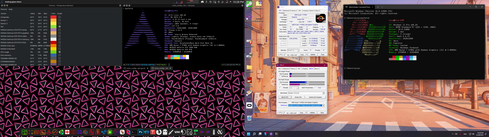

# Guide to KVM/QEMU by Ozzy and Kori
#### Config files and Guide



### Introduction
VFIO allows people to run Windows for apps that simply can't run in Linux. Its a good solution for app compatibility. Its not perfect but it would allow people to run games and apps that will not run in Wine or Steam Proton.
The draw back its not the best solution for apps that use anti-cheat software to protect multiplayer experiences.

# In-Depth Guide
if you want a more in-depth guide on how to do all this I have it [here](https://github.com/OzzyHelix/virtio-guide/blob/main/in-depth.md).

# Note
this contains UUIDs for my VMs its meant to be private so I can't lose Windows keys to people copying my VMs

### System Specs
* **Motherboard:** MSI MPG X670E CARBON WIFI
* **CPU:** Ryzen 9 7900X3D [12c/24t] @ Stock
* **RAM:** Corsair Vengeance RGB 64 GB (2 x 32 GB) DDR5-6000 CL30
* **GPU1 (Host):** ASRock Challenger OC Radeon RX 7800 XT 16 GB @ Stock
* **GPU2 (Guest):** MSI RTX 2070 Super 8GB @ Stock
* **Storage:** 1 x Western Digital Blue SN570 1 TB M.2-2280 PCIe 3.0 X4, 1 x Samsung 990 Pro 4 TB M.2-2280 PCIe 4.0 X4 NVME, Patriot P400 Lite 2TB NVME, 1 x 8TB Toshiba X300 HDD*
* **OS (Guest):** Windows 11 Pro
* **OS (Host):** Arch Linux running on the CachyOS Kernel

*Host on the WD Blue drive and Guest drives are stored on an SSD and HDD with the other HDD serving as a backup drive.*

* here is a hardware probe to give you a better idea of my system

   https://linux-hardware.org/?probe=7b57b31209

### Troubleshooting
### Zen Kernel and ACS Patch
I recommend the Linux Zen Kernel because it includes the ACS Patch as a kernel launch option in your bootloader of choice that flag being `pcie_acs_override=downstream,multifunction`
#### Motherboard
The MPG X670E CARBON WIFI serves as a good option for VFIO,  It's GPU/USB card IOMMU groups are as follows (all groups in the iommu file):
```
IOMMU Group 20:
        05:00.0 VGA compatible controller [0300]: NVIDIA Corporation TU104 [GeForce RTX 2070 SUPER] [10de:1e84] (rev a1)
IOMMU Group 21:
        05:00.1 Audio device [0403]: NVIDIA Corporation TU104 HD Audio Controller [10de:10f8] (rev a1)
IOMMU Group 22:
        05:00.2 USB controller [0c03]: NVIDIA Corporation TU104 USB 3.1 Host Controller [10de:1ad8] (rev a1)
IOMMU Group 23:
        05:00.3 Serial bus controller [0c80]: NVIDIA Corporation TU104 USB Type-C UCSI Controller [10de:1ad9] (rev a1)
IOMMU Group 45:
        14:00.0 USB controller [0c03]: Renesas Electronics Corp. uPD720201 USB 3.0 Host Controller [1912:0014] (rev 03)

```
The RTX 3060 is fully isolated and works with the VM and the RX 7800 XT is not

#### Configuring hardware and dedicated drives
Then a Virtio SCSI controller must be configured in virt-manager ('Add Hardware' -> 'Controller' -> 'SCSI'). Finally, you must go into the vm and install special drivers for the SCSI controller that should show up in Device Manager. Those drivers can be located in the iso [here](https://fedorapeople.org/groups/virt/virtio-win/direct-downloads/archive-virtio/virtio-win-0.1.248-1/)

### Looking Glass
I use looking glass to interface with the VM
Looking Glass is a powerful tool that allows Windows and Linux applications to live side by side, but requires a little extra configuration. (1920x1080) display. if you wanna use it on an ultrawide (2560x1080) display. you need to change the shared memory buffer to 64MB
```
size unit='M'>64</size>
```
#### Blue screen upon starting looking-glass-client
A blue screen for looking glass is simply displayed when the client is waiting for the host to start relaying frames. Make sure that the host is correctly configured, and looking-glass-host is running. 
#### Getting Looking Glass working
a link to the aur package for looking glasss is [here](https://aur.archlinux.org/packages/looking-glass). and a link to the Windows installer for the guest is [here](https://looking-glass.io/downloads). installing looking glass on the Windows guest will install the IVSHMEM Drivers needed for looking glass to work

#### Scream Audio
Scream is a network based sound device driver for Windows on Linux there is a client that you can run from the command line and you can install the driver in Windows which can be found [here](https://github.com/duncanthrax/scream). I recommend setting up a network bridge in Linux so you can do the command `scream -i <bridge_network>` and you should be able to get audio over a bridge network that runs internal to the system
there is a script in this repo you can run with powershell to install scream in the VM
